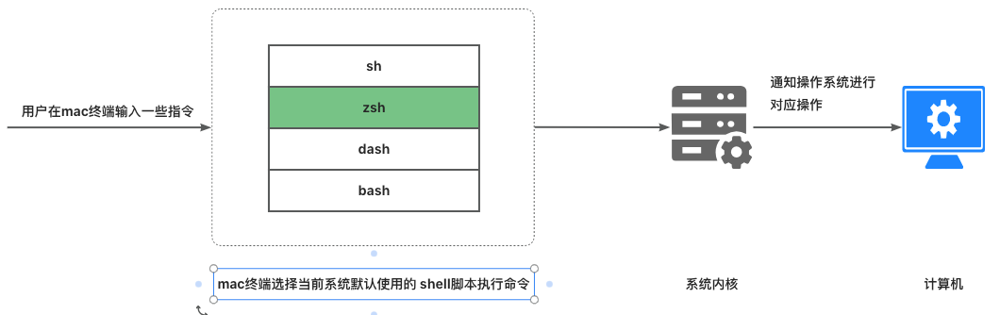
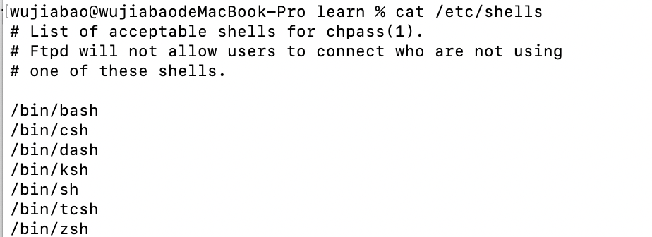
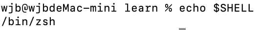
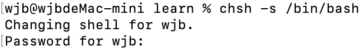
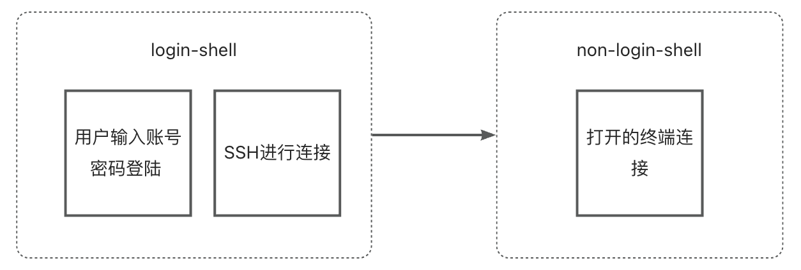
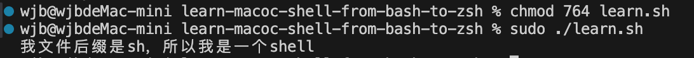
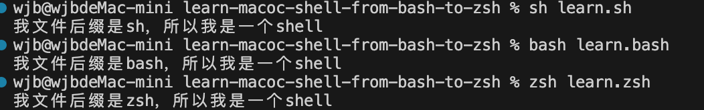

> Mac程序员需要知道的Shell知识

# 1.什么是 shell

熟悉 Mac OS 的程序员都应该对 shell 有一定的了解。

在工作中，我们经常会使用一些 shell 命令来进行一些文件操作，比如下面这个 shell 命令：

```sh
# 在当前目录下创建了一个 learn 文件夹
mkdir learn
```



shell 是和系统内核指令打交道的一座桥梁。我们通过键盘输入一种自己容易记忆识别的符号标识（shell命令），有 shell解析这些命令再反馈给内核去执行一系列操作。

# 2.shell类型

shell的类型分为很多种。不同的 shell 语法可能会有不同。

系统某些服务在运行过程中，会去检查用户能够使用的 shells，而这些 shells 的查询就是借助 /etc/shells 这个文件，使用 ```cat /etc/shells``` 命令查看当前系统支持哪些 SHELL脚本。



可以看见Mac系统支持了很多种shell类型的使用。

目前最常用的就是```sh、 bash 和 zsh```。接下来会重点说这 3 个。

## 常用的shell - sh

sh 是 shell 的缩写。

是 Unix/Linux 系统的默认 shell，也是最古老的 shell之一。

sh 是标准的```POSIX shell```，有许多不同版本和实现，如 Bourne shell 和 POSIX shell。 

## 常用的shell - bash

bash全称是Bourne Again shell ，目前被绝大多数 Linux 系统所使用。

它是对Bourne shell的重新实现。

那么为什么要费劲巴拉的重新写一遍这个呢？这不是在重复造轮子嘛！

因为Bourne shell是Unix系统的一部分，自由软件之父Richard Stallman在1983年开始发起了GNU运动，GNU运动的目标是实现一个免费自由的操作系统，以解决Unix系统收费的一些限制。

要做一个类似的 Unix 系统，理所当然的 Unix 上有的，都得自己重新实现一套，因为 Unix 上的东西都是有版权限制的，自然对于shell也是如此。

Unix上的Shell是Bourne shell，于是GNU也做了一个Shell，名称就是Bourne Again shell，简称Bash。

而Linux之父在1991年发布的Linux内核中，最开始只有两个程序，一个是GCC，另一个则是Bash了，它们都是GNU软件。

至于后面发展起来的Linux操作系统，我在以前的文章中也说过了，其实就是Linux内核 + GNU软件，所以Linux操作系统也叫GNU/Linux操作系统。

这就是为什么Linux发行版本中，大多使用的是Bash的原因了。

## 常用的shell - zsh

Zsh其实是对Bash的扩展，它基于Bash之上添加了很多新特性，它包括了Bash，Ksh以及tsch的一些特性的集合。

所以Zsh可以说是更好的Shell，但由于Linux上述讲述的历史原因，大多数Linux发行版本仍然是用的Bash。

# 3.苹果为什么要将默认的Shell从bash转成zsh

因为```License限制```。

其实在```Catalina版本```之前，MacOS一直使用的都是```Bash```。

但是由于Bash在版本3.2之后，将开源协议由GPLv2更换为了GPLv3。

GPLv3是GPLv2的改进版本，它解决了GPLv2的一些缺点与不足，其中一个重要的点就是，扩大了GPL强制传染力的约束。

也就是如果你的产品使用了GPLv3的类库或框架，你的产品不管是否包含独立可区分的部分，也一定也同样的按照GPLv3协议进行开源。（GPLv2时，使用了GPLv2的产品，如果包含可区分的独立部分，非全部派生自开源软件，则可以不受GPL传染力约束）。

可想而知，这不是Apple希望看到的结果，这也是苹果长久时间一直使用的Bash 3.2的原因所在。使用Bash 3.2的MacOS仍然可以不用开源，但如果使用GPLv3的话，则MacOS也一定得开源了。

但是如果一直使用一个相当陈旧的Bash版本，对MacOS操作系统并不是一个合适的选择，于是Apple在MacOS Catalina后，选择了将Shell迁移至开源协议更友好的Zsh。

而Zsh使用的是MIT开源协议，MIT完全不限制商业使用，所以在```Catalina版本```之后，苹果就采用了Zsh作为默认的Shell。

# 4.如何查看当前终端所使用的Shell版本

可以直接用内置的echo命令来进行打印。

```sh
echo $SHELL
```


# 5.如何切换shell

上节课我们学习了如果查询当前终端使用的shell版本。

那么我们是否可以切换shell呢？当然也是可以的。

```sh
# 改变默认的 shell 为 bash
chsh -s /bin/bash
```


通过 ```chsh -s``` 可切换为其他已安装的 shell。 更改后需重启终端，以使命令生效。

# 6.shell的两种运行模式



## 登陆模式（login模式）

用户输入登录系统时 / 使用SSH与系统获得连接时启动的第一个 shell 称为登录 shell。在这个过程中，用户需要提供用户名和密码。

login shell 会读取系统配置文件 (🌰 /etc/profile) 来设置系统的整体环境，同时也会读取用户个人的配置文件（🌰 ~/.bash_profile 或 ~/.bash_login）来设置用户个人的环境。

> 获取 shell 时需要完整登入流程的，从tty1~6终端登入系统输入账号密码，就是 login shell。 

## 非登录模式（non-login模式）

用户登录后启动的shell。non-login shell 可直接从 login shell 中继承环境和配置，主要用于执行用户在桌面环境下的交互式任务，如打开终端、编辑文件等。这些不需要输入账号密码。

> 无需重复登入流程的，比如在系统内部启动 tty1~6，不用输入账号密码，就为 non-login shell。

## 总结

简单来说，登录 shell 更像是用户进入系统时的入口点，它负责加载用户的环境配置，而非登录 shell 则更像是在现有环境中执行临时任务或脚本的工具。如果你使用终端模拟器打开一个新的标签页或窗口，那么你得到的是一个非登录 shell。而如果你通过 SSH 连接到远程主机，并且该连接是作为登录会话开始的，则你会得到一个登录 shell。

# 7. `#!/bin/sh`究竟是干嘛用的

你经常可以看到在一个Shell脚本中的最上面写了这样一行代码。

```sh
#!/bin/sh

echo "这是一个SHELL脚本，我用的是/bin/sh"
```

这一行代码告诉系统使用哪个解释器来执行脚本。在这个例子中，/bin/sh 指定了使用 Bourne shell来解释脚本。

通常情况下，我们都是使用/bin/sh,因为它是所有系统中都基本是存在的。而/bin/zsh这样的，不一定会存在。

# 8. 如何新建一个shell脚本

* 新建一个不带后缀的文件，写上```#!/bin/sh```自动执行

```sh
#!/bin/sh
echo "我没有文件后缀，但是我依然是一个shell";
```
* 新建一个带shell类型的文件后缀，如```learn.zsh、learn.sh、learn.zsh```

```sh
#!/bin/sh
echo "我文件后缀是sh，所以我是一个shell";
```

```bash
#!/bin/bash
echo "我文件后缀是bash，所以我是一个shell";
```

```sh
#!/bin/zsh
echo "我文件后缀是zsh，所以我是一个shell";
```

# 9. 如何执行一个shell脚本

## 1. 工作目录执行

指的是执行脚本时，先进入到脚本所在的目录，然后使用 ./脚本方式执行。



这里会遇到权限错误。这里需要赋权。使用chmod 764 learn.sh赋权后就可以正常执行了

## 2. 绝对路径执行

绝对路径中执行，指的是直接从根目录/到脚本目录的绝对路径。


## 3. sh执行

sh执行，指的是用脚本对应的sh或bash来接着脚本执行。


## 4. shell环境执行

shell环境执行，指的是在当前的shell环境中执行，可以使用 source 接脚本。

